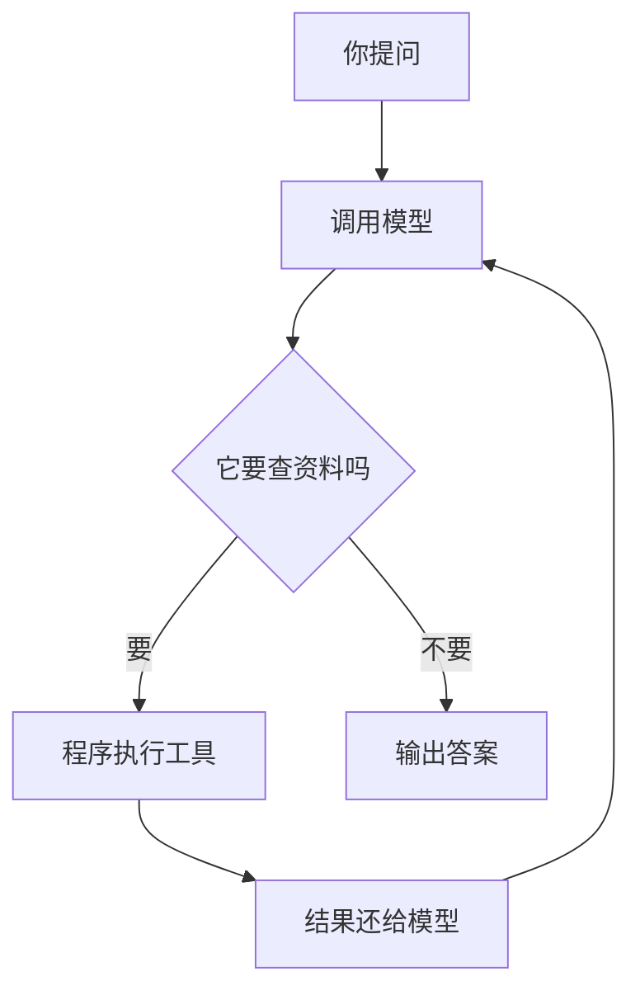

# 第 4 章：Agent 循环

> 目标：看懂一个完整的 Agent 是怎么转起来的，谁负责喊停。

## 核心不是提示词，是"转圈"

Agent 的本质是个循环：



模型负责"想下一步"，程序负责"真的去干"和"喊停"。**模型永远不能自己决定无限干下去。**

## 模型想用工具时，长这样

```json
{
  "type": "function_call",
  "name": "search_docs",
  "call_id": "call-1",
  "arguments": "{\"query\":\"请假审批\"}"
}
```

就像它递了张**申请单**："我要用 `search_docs`，参数是这个。"

程序执行完，把结果绑在同一个单号上还回去：

```json
{
  "type": "function_call_output",
  "call_id": "call-1",
  "output": "{\"ok\":true,\"documents\":[...]}"
}
```

`call_id` 就是**单号**。为什么不能省？因为同一个工具可能被调好几次，没单号就分不清哪个结果对应哪次请求。

## 循环里最重要的几行

```javascript
input.push(...response.output);           // 把模型的输出全留下
const calls = response.output.filter(item => item.type === 'function_call');

for (const call of calls) {
  const result = executeTool(call);       // 程序执行工具
  input.push({                            // 结果绑单号还回去
    type: 'function_call_output',
    call_id: call.call_id,
    output: JSON.stringify(result),
  });
}
```

三点：

1. **别只留文字**，工具请求、推理状态这些项目下一轮可能还要用。
2. **一轮可能有好几个工具请求**，全处理，别只取第一个。
3. **工具结果是程序写的**，模型不能自己填"成功"。

完整代码在 [examples/agent.mjs](examples/agent.mjs)，跟着一次请求走一遍：`问题 → 调用 → 工具 → 回传 → 再调用`。

## 谁决定停下来

模型可能觉得"我还能再查一次"，但**程序才是说了算的那个**。主例设了几道闸：

- 最多 4 轮对话
- 最多 6 次工具调用
- 问题 1～2000 字符
- 检索词 ≤ 200 字符
- 单次输出 1200 Token
- 单次请求 20 秒、整任务 60 秒

到点了没结果，就返回 `turn_limit` 之类的状态，**绝不假装"完成了"**。

## 出错了怎么办

分两种：

- **小错**（比如参数填错）：把错误告诉模型，让它换参数重试，仍受总预算管。
- **大错**（比如要调用不存在的工具、鉴权失败、输出截断）：直接停，不硬来。

最危险的一种：**写操作超时了**。这时不能默认"没成功所以再执行一次"——可能已经执行了，只是回执没收到。要先查真实状态。

## 一句话总结

Agent = 一个带刹车和护栏的循环：模型出主意，程序干实事、记轨迹、该停就停。

[上一章](03-提示词与输出契约.md) · [下一章：工具调用](05-工具调用.md)
