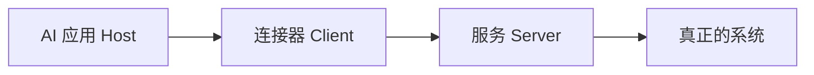

# 第 8 章：MCP——工具的"插座"

> 目标：搞懂 MCP 是干嘛的，以及为什么"接上了"不等于"可以信"。

## 它解决一个"接来接去"的麻烦

没有统一接口时，每个 AI 应用都要为同一个系统单独写一套连接代码。工具一多，工作量爆炸。

MCP（模型上下文协议）就是定一套**统一插口**：AI 应用按这个标准去发现工具、读资料、用模板。

打个比方：**像电源插座。** 电器只要插头符合标准就能用，不用每家电器自带一个专用插座。但插座统一，不代表插进来的电器都是好的。

## 三个角色



- **Host**：AI 应用，管模型和权限。
- **Client**：应用里负责跟某个服务对话的组件。
- **Server**：提供工具或资料的那一方。

它主要提供三样：**工具（Tools）**、**资料（Resources）**、**模板（Prompts）**。

## 接上之后，真正发生什么

```text
确认协议版本和授权
  → 发现对方有什么能力
  → 挑出允许用的工具
  → 转成模型认识的工具定义
  → 模型要调用时，再做权限和参数检查
  → 调服务，检查结果和错误
  → 把结果回给模型
```

三个坑：

1. **对方的参数格式，不一定能原样用**——可能要转换，不支持的得拒绝。
2. **工具出错，可能藏在"HTTP 200 成功"里面**——别只看网络状态。
3. **模型还是只看到你给它暴露的工具**——MCP 不替你管循环，也不自动修坏工具。

## 别把版本和传输搞混

MCP 规范有版本（本轮核对为 **2026-07-28**）。老教程里的写法可能已经过时。

- 传输方式主要是：本机 `stdio`、远程 Streamable HTTP。
- 别把"SDK 的版本号"当成"协议版本"，两码事。

刚入门不用自己写协议报文，挑个支持对应版本的 SDK，看"发现 → 列工具 → 调用 → 报错"这四步能不能跑通就行。

## 工具多，不代表都能用

工具一大把时，一次全塞进去又贵又乱。常见做法是**先给目录，命中任务再加载详情**。

但注意：**这优化的是"省上下文"，不是"授权"。** 后加载的工具照样要白名单、身份校验。工具描述里写"只读"也不能直接信——描述也可能是注入。

## MCP、Skills、A2A 怎么分工

- **MCP**：给 Agent 接工具和资料（"用什么"）。
- **Skills**：告诉 Agent 某类任务怎么做（"怎么做"），下章讲。
- **A2A**：跨服务把活委托给另一个 Agent（"交给谁"）。

简单项目直接调本地函数就行，不必为了用标准而用标准。

## 一句话总结

MCP 是"统一插座"，让你少写重复的连接代码；但插上 ≠ 可信，权限照样要自己把关。

[上一章](07-上下文与记忆.md) · [下一章：Agent Skills](09-Agent-Skills.md)
