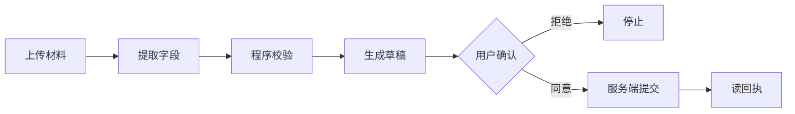

# 第 12 章：工作流与多 Agent

> 目标：学会什么时候该拆、什么时候别拆。别给每个函数都起个 Agent 名字。

## 先试一个 Agent

一个模型配几个明确工具，已经能解决很多问题。**拆分的唯一理由，是解决具体瓶颈**：上下文互相干扰、权限不同、子任务独立，或需要不同能力。

"请假找谁批"这种问题，没必要请规划、研究员、审核、汇总各跑一轮——角色越多，越慢、越容易传错话。

判断标准：**拆完之后，成功率、延迟、成本、安全性真的变好了吗？**

## 四种组织方式

| 方式 | 谁说了算 | 例子 |
| --- | --- | --- |
| 固定流程 | 代码 | 提取 → 校验 → 草稿 → 审批 |
| 路由 | 分类后交一个处理器 | 咨询和下单走不同流程 |
| Agent 当工具 | 主 Agent 派活、收结果 | 查三份资料后汇总 |
| 移交 | 后续对话交给别人 | 客服转给专员 |

"当工具"像请同事查个资料，最后还是你回复；"移交"像把接待整个交给同事。

## 固定流程：把确定性留给代码

报销流程就该定死：

关键不是"用了几个模型"，而是**每步都有输入、输出和失败出口**。模型不能跳过"确认"直接提交。

## 多 Agent 什么时候真有用

任务："比较三个独立项目的部署方案。"可以让三个只读子 Agent 各查各的，主 Agent 汇总。

价值在于**并行、上下文隔离、各自专用工具**，不是"人多力量大"。三个子任务强依赖彼此的话，就别硬并行。

## 委托时最容易丢的

- 原用户的约束（"只研究，不改"）。
- 证据出处（子 Agent 的二手结论被当一手事实）。
- "没做完"的状态（把部分完成说成全部完成）。
- 总预算（每个子 Agent 各有上限，加起来还是超）。

## 给协作加四条护栏

1. **总预算**：总轮数、总工具次数、并发数都限。
2. **单一写者**：别让多个 Agent 同时改同一份东西。
3. **失败要说清**：成功、没证据、超时、拒绝，分开标。
4. **别无限踢皮球**：A 转 B、B 转 A，设个深度上限。

## 多模型投票能防"幻觉"吗

不能。多个模型可能犯同一个错，也可能互相吹捧。**只有独立证据和可检查的标准才靠谱。**

"三个 Agent 都说成功"不等于数据库有回执。

## 一句话总结

先单 Agent 跑通；拆的前提是"真有瓶颈"，且拆完要有全局预算和明确的失败语义。

[上一章](11-Computer-Use.md) · [下一章：框架选型](13-框架选型.md)
