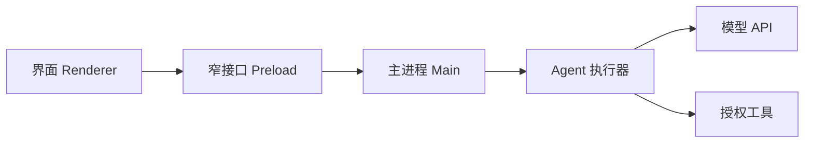

# 第 14 章：Electron 集成

> 目标：把做好的 Agent 接进桌面应用，重点是"别把权限边界做漏"。本章需一点 Electron 基础。

## 桌面端多了什么

对话框没改变 Agent 循环，但桌面应用能碰本地文件、系统权限和用户凭据——**一个网页漏洞，可能因此变成更严重的本机事故。**

先做只读助手：输入问题、显示回答、看来源、能取消。别一上来就开放任意终端命令和全盘访问。

## 进程边界 = 能力边界



- 界面只提交任务，**不碰密钥、不直接读文件**。
- Preload 只暴露几个按用途命名的方法，**别把整个 `ipcRenderer` 交出去**。

## 窗口先设这几样

```javascript
webPreferences: {
  preload: preloadPath,
  contextIsolation: true,
  nodeIntegration: false,
  sandbox: true,
}
```

这是起点，不是全部。还得管好页面来源、导航、权限请求。**别为省事给远程页面开 Node.js，别靠关掉 `webSecurity` 解决跨域。**

## Preload 只开三个口

```javascript
contextBridge.exposeInMainWorld('agent', {
  start: q => ipcRenderer.invoke('agent:start', { question: q }),
  cancel: runId => ipcRenderer.invoke('agent:cancel', { runId }),
  onEvent: cb => { /* 订阅事件，返回取消函数 */ },
});
```

要点：别把 `_event` 这类原始对象给界面；事件只发给任务所属的窗口，别广播所有人的日志。

## 主进程要验什么

1. 发送者是不是可信窗口和主框架。
2. 来源 origin 对不对。
3. 参数长度、结构、并发有没有超。
4. 任务是不是属于当前用户，取消别影响别人。

## 任务状态要清晰

```text
idle → running → answered / awaiting_approval / cancelled / failed
```

每个事件带 `runId` 和序号；旧任务晚到的消息不能写进新对话。**取消 ≠ 撤销**——已经发的邮件、已经提交的事务，以真实状态为准。

## 文件与密钥

- 读本地资料：用户选目录/文件，只给必要范围。
- 产品共用的模型 Key：**留在服务端**，桌面端只拿用户会话凭据。
- 用户自带 Key：放系统凭据存储，界面只显示掩码。

`path.startsWith(root)` 不是完整校验；ASAR、混淆、打包也不是密钥保险箱。

## 模型输出不是可信 HTML

最简单就用纯文本。要渲染 Markdown，禁用原始 HTML 或加清洗，**别 `innerHTML = 模型文字`**。外链、文件打开都要过授权。

## 发行前自检

- 反复进出页面，事件不重复、监听和任务被清理。
- 两个窗口互不串线。
- 断网、超时、取消都显示明确状态。
- 恶意 Markdown 不能跑脚本。
- 安装包不含真实 Key、历史数据。

## 一句话总结

桌面端的关键是把"界面 → 主进程 → 工具"每层都当边界守，模型输出当不可信数据处理。

[上一章](13-框架选型.md) · [下一章：评估、安全与上线](15-评估安全与上线.md)
